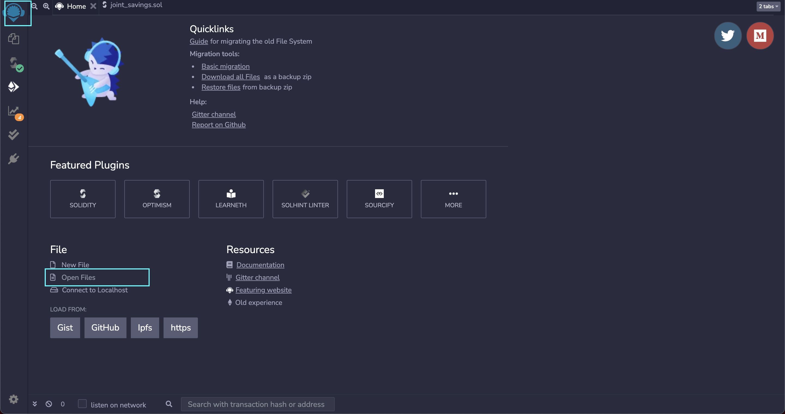
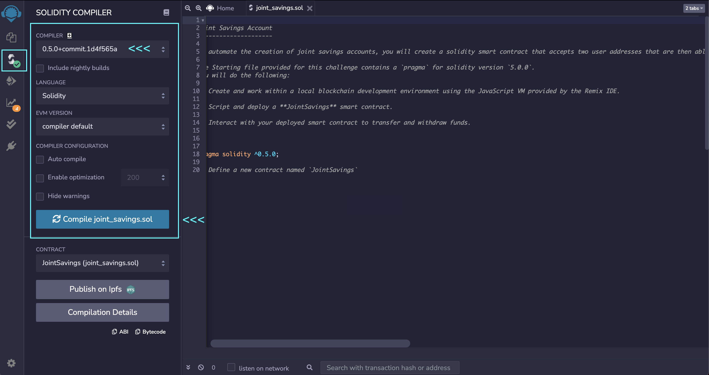
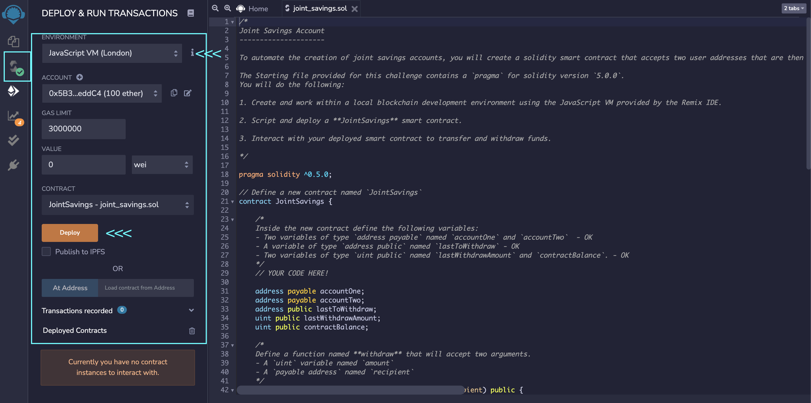

# Module 20 Challenge: Joint Savings Account

## Table of Contents

[Joint Savings Account](https://github.com/juzcho/Module-20-Challenge-Joint-Savings-Account#joint-savings-account)

[Technologies](https://github.com/juzcho/Module-20-Challenge-Joint-Savings-Account#technologies)

[Installation/ Usage Guide](https://github.com/juzcho/Module-20-Challenge-Joint-Savings-Account#installation-usage-guide)

[Examples](https://github.com/juzcho/Module-20-Challenge-Joint-Savings-Account#examples)

[Contributors](https://github.com/juzcho/Module-20-Challenge-Joint-Savings-Account#contributors)

[License](https://github.com/juzcho/Module-20-Challenge-Joint-Savings-Account#license)

---

## Joint Savings Account

This project is about creating an application to automate the creation of a join savings accounts with the use of Solidity smart contract. This smart contract will use ether management functions to implement a financial institution’s requirements for providing the features of the joint savings account. These features will consist of the ability to deposit and withdraw funds from the account.

---

## Technologies

This project leverages **[python version 3.8.5](https://www.python.org/downloads/)** with the following packages and modules:

* [pandas](https://pandas.pydata.org/docs/) - *version 1.3.2* - This was used to be able to easily manipulate dataframes and create dataframes.

* [hashlib](https://docs.python.org/3/library/hashlib.html)- This module implements a common interface to many different secure hash and message digest algorithms. In our application, we use SHA256 to return a hexdigest.

* [web3.py](https://web3py.readthedocs.io/en/stable/overview.html) - This is a Python library for connecting to and performing operations on Ethereum-based blockchains.

* [Solidity](https://docs.soliditylang.org/en/v0.8.9/) - This is used to create the smart contract and implement the joints saving application to work with ether.

* [Remix IDE](https://remix.ethereum.org/) - This is used to be able to write and edit solidity formatted code, and this is where the joints saving application will be launched.

---
## Installation/ Usage Guide

### 1. Use [REMIX IDE](https://remix.ethereum.org/) to view and edit the `joint_savings.sol` file.

- Make sure to `git clone` the file first from this repository. 

### 2. Then when on the REMIX IDE, click on the left icon logo, and then click Open file and navigate to where the git clone files are locally saved on your machine.

- This should open the file through this IDE for you to compile the smart contract.

### 3. Compile the `joint_savings.sol` file and make sure that the compiler is version 0.5.0.

### 4. Compile the Contract in the "JavaScript VM", once this is done, then click Deploy.

---
## Examples

### **This gif should show you what happens when each transaction is done.** 

#### **Transaction 1: Send 1 ether as wei:**

#### **Transaction 2: Send 10 ether as wei.**

#### **Transaction 3: Send 5 ether.**

---

## Contributors

Contributed by: Justine Cho

Email: juz317_cho@yahoo.com

[ LinkedIn](https://www.linkedin.com/in/justinecho)

---

## License

### **MIT License**

Copyright (c) [2021] [Justine Cho]

Permission is hereby granted, free of charge, to any person obtaining a copy
of this software and associated documentation files (the "Software"), to deal
in the Software without restriction, including without limitation the rights
to use, copy, modify, merge, publish, distribute, sublicense, and/or sell
copies of the Software, and to permit persons to whom the Software is
furnished to do so, subject to the following conditions:

The above copyright notice and this permission notice shall be included in all
copies or substantial portions of the Software.

THE SOFTWARE IS PROVIDED "AS IS", WITHOUT WARRANTY OF ANY KIND, EXPRESS OR
IMPLIED, INCLUDING BUT NOT LIMITED TO THE WARRANTIES OF MERCHANTABILITY,
FITNESS FOR A PARTICULAR PURPOSE AND NONINFRINGEMENT. IN NO EVENT SHALL THE
AUTHORS OR COPYRIGHT HOLDERS BE LIABLE FOR ANY CLAIM, DAMAGES OR OTHER
LIABILITY, WHETHER IN AN ACTION OF CONTRACT, TORT OR OTHERWISE, ARISING FROM,
OUT OF OR IN CONNECTION WITH THE SOFTWARE OR THE USE OR OTHER DEALINGS IN THE
SOFTWARE.
